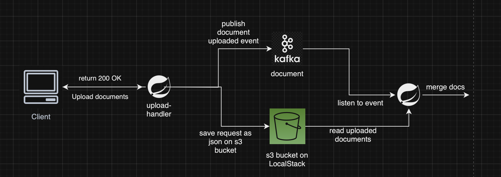

## Document Management System
Imagine a scenario in which some document data is required from the user to complete an action. A document might consist of one or multiple pages and in some cases you might need to upload & process documents taken from a client application. Running these operations sequentially might be costly, thus this implementation provides a low cost solution with event-driven architecture. 

In these repo, you will find two services which are used to accomplish the task of uploading (upload-handler) & processing (document-processor) of documents in an event-driven way. upload-handler service handles document upload requests and publishes a document uploaded event which would eventually trigger processing of the uploaded documents. document-processor service consumes document uploaded events and merges the uploaded document data for each document type.

## Architecture



## Tech Stack
 <ul>
  <li><a href="https://localstack.cloud">Localstack</a> cloud emulator</li>
  <li>Apache Kafka</li>
  <li>Spring Boot</li>
  <li>Docker</li>
</ul>

## Running
### Prerequisites
 <ul>
  <li>Docker & Docker Compose</li>
  <li>JDK 17</li>
</ul>

To create Localstack & Kafka instances on docker run: 
```
docker compose up
```
Then you can run document-processor & upload-handler services on your local machine. You can use the postman collection under postman directory to test the services.


